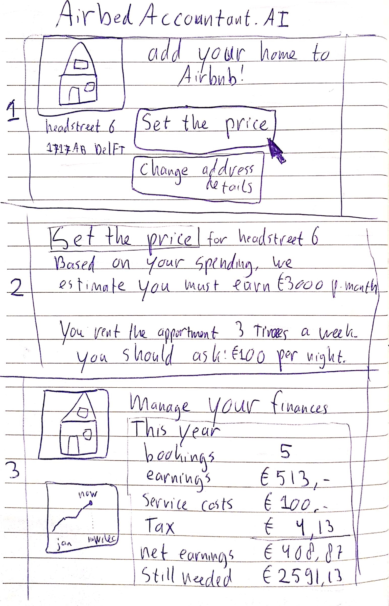

# Phase 2: towards multiple solutions

In the previous phase we determined which constraints we want to tackle in this Sprint and what role to focus on. We agreed on the challenge we want to solve. Here we want to get to potential solutions for tackling the constraints. These solutions are crude candidates of our MVP.

## Get inspired with Lightning Demos

Before proceeding to the next exercises, take a moment with the group to invoke some creativity and get inspired by existing ideas. With the Sprint Questions in mind we search the Internet for ideas from other products and platforms, from other domains or maybe from within your own company, that solve a similar challenge. The findings are then shared with the others in quick presentations called Lightning Demos.

> **Exercise Lightning Demos \(10 + 2\*participants mins\)**  
> Draw inspiration from other solutions on how to solve the Sprint Questions.   
> - \[10 mins\] Take 10 minutes to individually look for other platforms that solve the “Can we…” Sprint Questions. These could very well be outside the industry you are looking at for your own platform. For instance, if we make a food delivery service we could look at how postal platforms or taxi platforms solve the problem of ‘delivery’. Write them on rectangular post-its with product name, the idea / learning / solution and some extra details.   
> - \[2 minutes per person\] Present the solutions you found along with how they solve which problem.

## Sketching: a 4-step process

Now its time to make things tangible. This whole exercise is done **together alone**, which is Design Sprint language for individually. There are four steps: Note Taking, Ideas, Crazy Eights, and creating a 3-step concept.

### 1. Note Taking

We get started by taking a moment to inspect all previous findings and write down what we already have. Everyone takes a piece of paper, preferably on a clipboard, and creates an overview of the 2 Year Goal, the Sprint Questions, the Map and your favourite Lightning Demos. This step is really about copying what we already have and not about coming up with new stuff.

> **Exercise Note Taking \(15 mins\)**  
> Take an A4 paper and write down the 2 Year Goal, the Sprint Questions, the Map and Target area and your favourite Lightning Demos. The remainder of the time is spent on writing down any thoughts or ideas that come up.

### **2. Ideas**

Armed with an overview of all information, we start flexing our creative muscles and convert parts or our notes into visuals. During this exercise we repeatedly pick a part of the notes that we like to explore and then draw a crude sketch of a possible solution until the time is over.

> **Exercise Ideas \(20 mins\)**  
> Repeat until the time has elapsed:  
> **-** Select a part of your notes from the previous step and circle it.   
> - Take an A4 and draw the challenge/problem/assumption/solution of what you circled.

You could draw the step-by-step process or a scenario or scene or anything else. It does not need to be detailed or ‘done’ yet. Drawings do not need to be beautiful \(indicated by our own not-so-beatiful drawing\) as these drawings are not shown to the others. Also, the idea does not need to be clear and detailed yet. We just want many ideas.

Below is one of our drawings related to the first Sprint Question. It depicts the full cycle starting with a vacant home put on Airbnb and ending with the Host receiving money and doing groceries. The thought of this idea is to set the price in such a way that the Host can cover its expenses by subletting its house.

### **3. Crazy Eights**

We now have some ideas on paper and we want to go beyond and make some rapid iterations on one of these. Crazy Eights is a rapid sketching exercise that helps us to do just that. We all draw eight drawings in eight minutes. People tend to get creative under time pressure and one minute per drawing is certainly pressuring, especially if you need to do it eight times in a row.

> **Exercise Crazy Eights \(10 mins\)**  
> - \[1 min\] Fold A4 paper 3 times in half so that you end up for 8 boxes if you unfold.   
> - \[1 min\] Choose one idea from the previous step that you like to explore further \(circle it\).   
> - \[8 mins\] Draw your ideas in eight different ways in the boxes \(1 min per drawing\).

Based on our example idea above, we sketched eight different variants of setting your price. It includes a simple rule-based method and even a solution that is just a text box but also more advanced stuff such as  with artificial intelligence or using an auction model.

Don't be afraid of noting down silly ideas and be sure to put the 'Crazy' in Crazy Eights. Solutions do not need to be viable, we just need to get as far out of the box as possible.

### 4. The 3 Step Concept

The sketch that we create in this exercise represents each person's best idea drawn out in three panels, taking into account everything from the start of the workshop until the Crazy Eights drawings we just created. Up to now everyone has been drawing in private and its time to show what we all created. 

> **Exercise 3 Step Concept \(30 mins\)**­  
> - Take 3 A4 pages and tape them together into a bigger paper. On each A4 you tape an A5 in the middle.  
> - Draw a 3-step story of a solution that solves the target area of the map. ­  
> - Post-its can be added for annotations and explanations.­  
> - At the end, hang all 3 Step Concepts on the wall.

While creating your concept you can keep in mind the 5 principles of the 3 Step Concept: Self-explanatory, Anonymous, Ugly is Okay, Words matter, Catchy title.

The drawings usually represent screens of the platform with buttons and images, but it could also be more abstract. As long as the idea is clear. In our case, we drew a Concept that allows a Host to set the price of its estate based on accounting and a bit of artificial intelligence. Airbnb would look into the Host's bank transaction data \(through PSD2 or other Open Banking solutions\) and extrapolate earnings of a room based on the number of days the Host wants to rent out its room. The artificial intelligence compares the expected income with the bank account expenses to come up with a suitable price that allows the Host to sustain itself.

At the end of this phase we have a set of Concepts, each carefully crafted by a participant. Each represents an opinionated hypothetical solution for solving the challenges at hand. 

