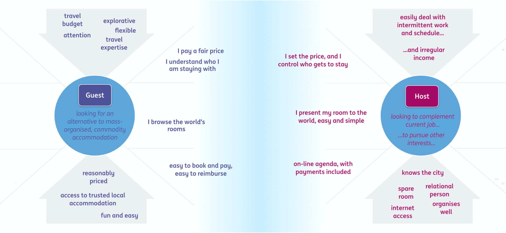
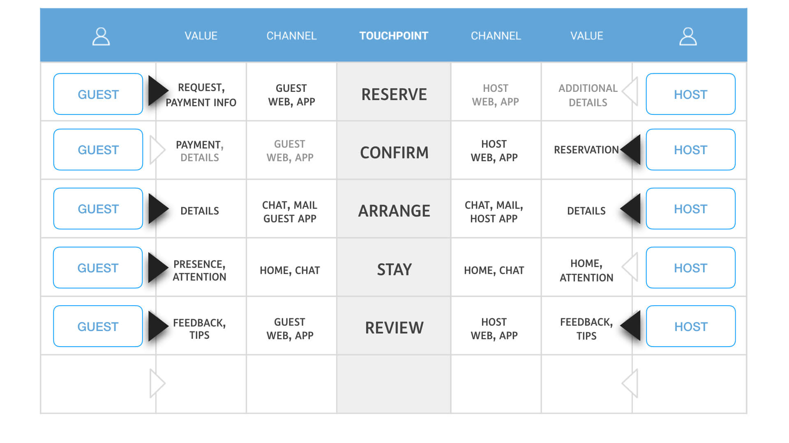
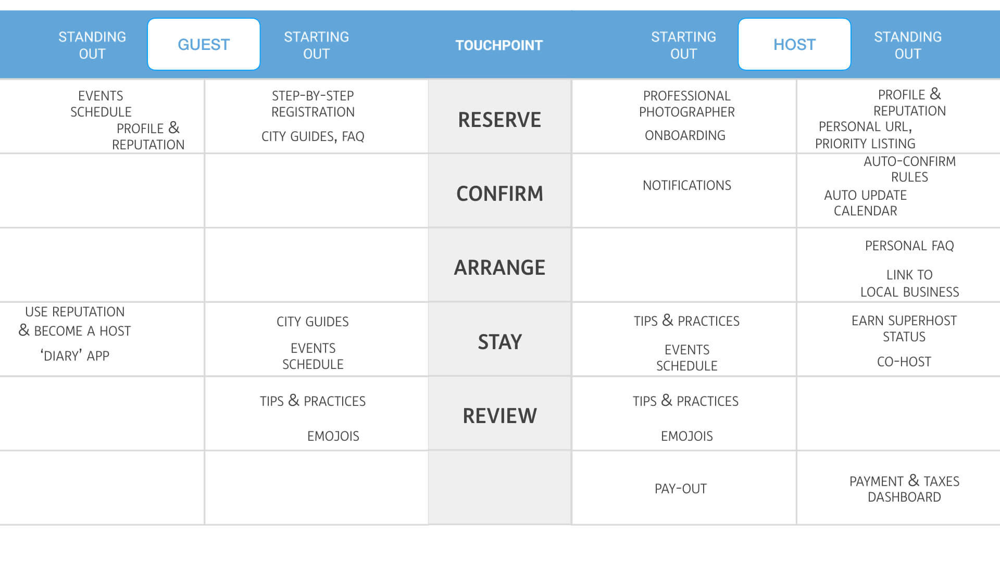
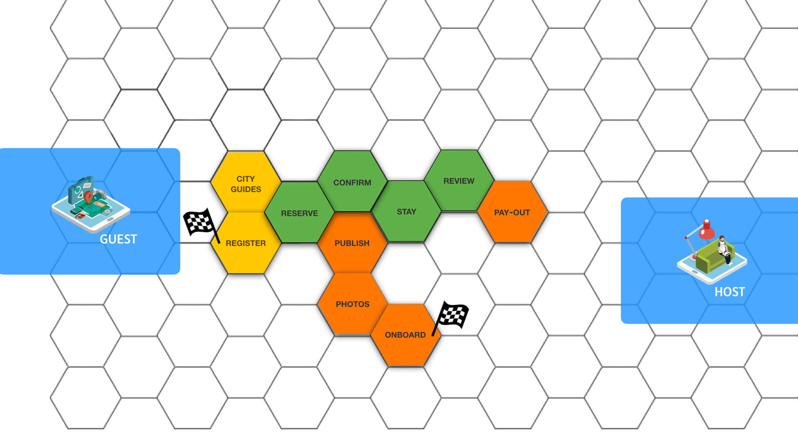

# Recap inputs from Position

We apply the workshop to Airbnb to make our descriptions of the exercises more clear. During the [Position](https://position.futuring-architectures.com/) workshop, some crucial steps towards the platform have already been taken. You find the canvases of that workshop below. For more in depth information you can check out the Postion workshop book.

## The main ecosystem relationship from the Ecosystem Portrait Canvas

## The touchpoints, channels and exchanges from the Transaction Engine

## The challenges and services from the Innovation Engine

## The journey of our main ecosystem players from the Experience Map

## 

